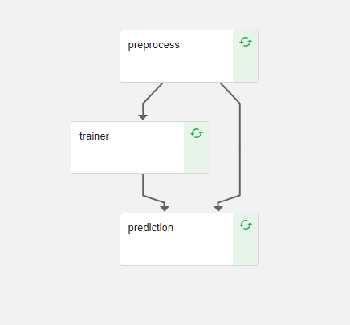

# Implementation of Kubeflow Pipeline with XGBoost

The main idea of the code reported in this folder is to implement a base kubeflow pipeline (KFP) to over the Exoplanet data set. The pipeline itself is composed by only three steps and should be considered as a POC for further and more complex pipelines.

 <p align="center">
  
</p>

The code used in the pipeline is designed to be used on GCP but can be easily reuse to deploy it on different providers.

## How to run it

The KFP is created inside the notebook __kubeflow_pipeline.ipynb__. The notebook load all the required configuration files of the pipeline, build the docker images and push them to Container repository of GCP. Finally with in the code is implement also the run to push the pipeline created to the K8 cluster.

The instructions about how to create the cluster are reported inside the notebook markdown.

#### Troubleshooting

1. bin/bash - permission denied: It can be solved by adding the executions' right to the file:
```
chmod +x build.sh push.sh
```
or to do this on git:
```
git update-index --add --chmod=+x build.sh
```

2. Sometimes the AI notebook is running into HTTP problems - this can be solved by restarting the kernel - not sure about the root cause of the problem.

## Possible Improvements
- Improve parameters handling
- Introduce the possibility to perform HPO with config yaml file
- Extend the pipeline to additional steps such as Feature Engineering
